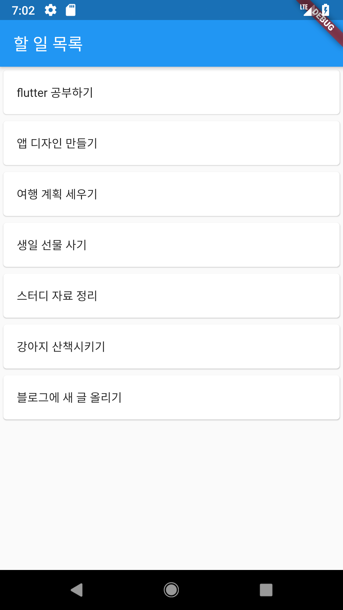
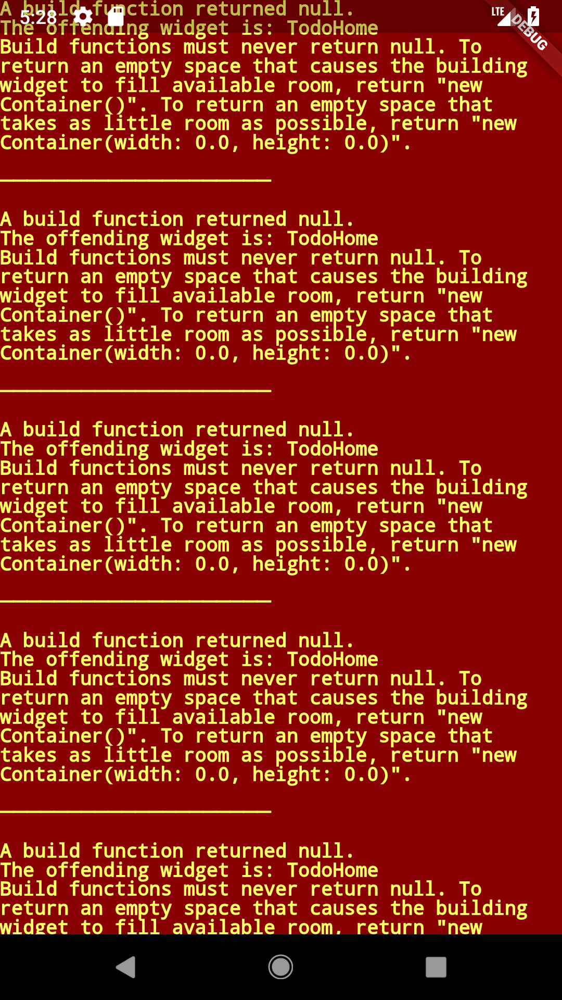
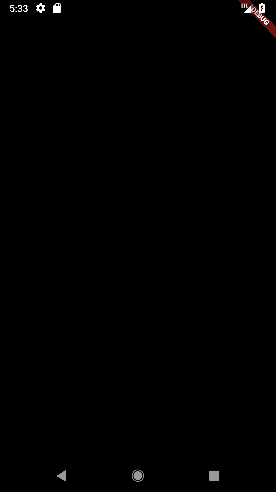
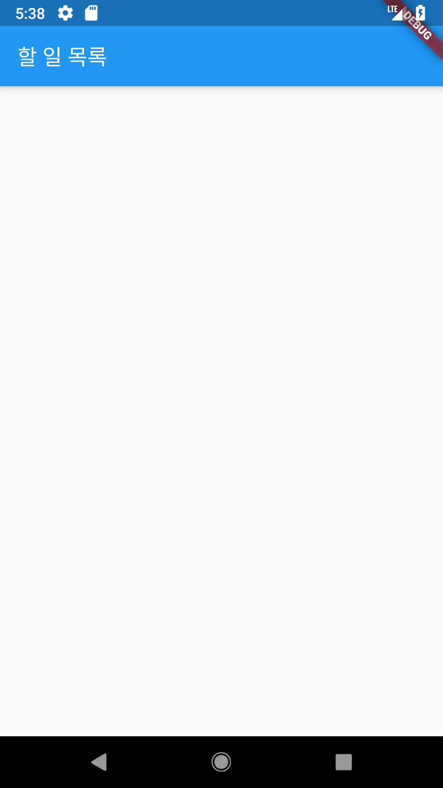
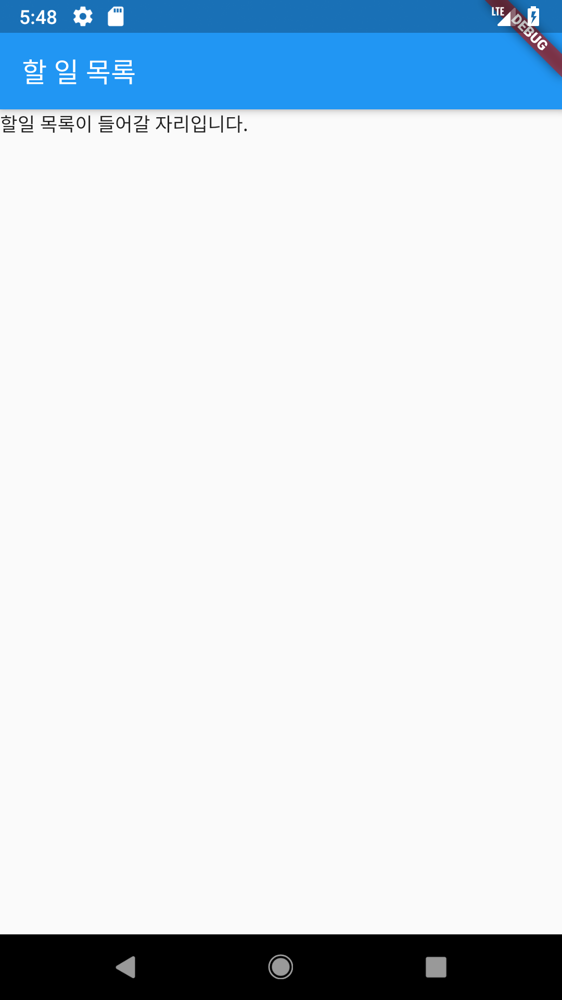
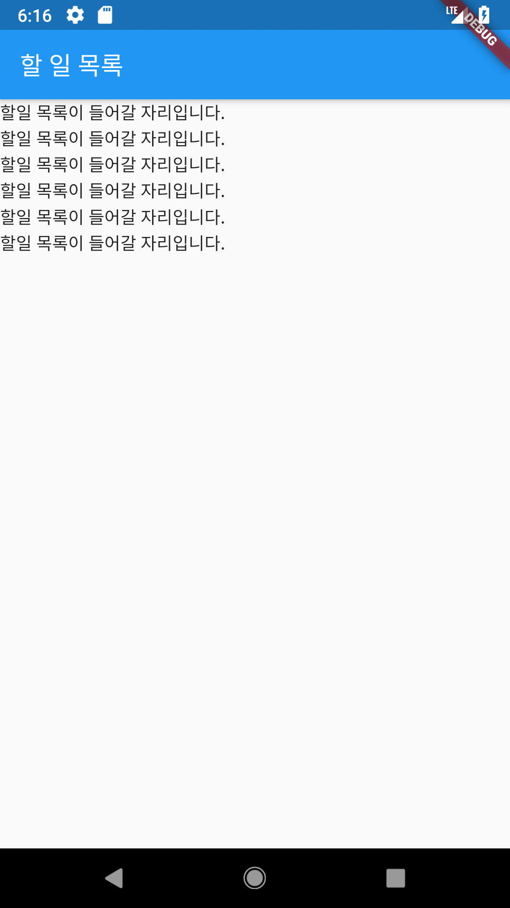
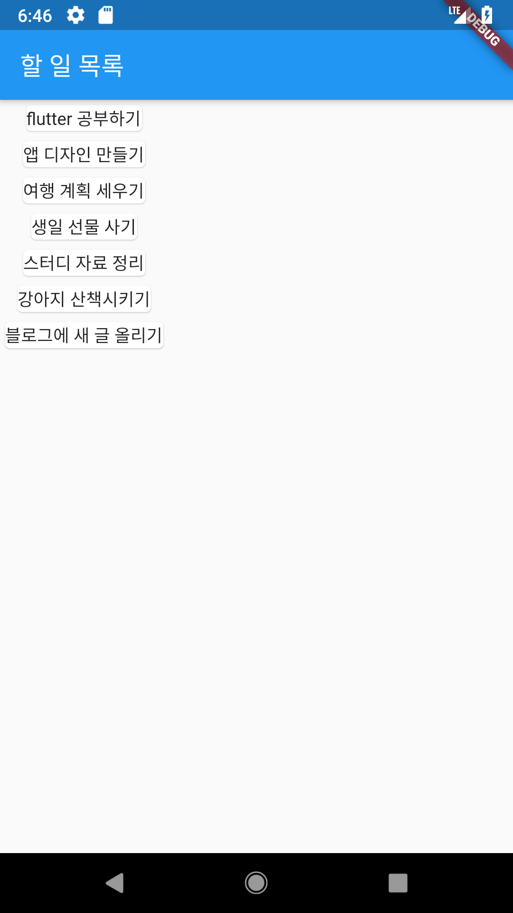

할일목록

이번 장에서는 할일 목록 앱을 만들어보면서 Flutter 의 위젯에 익숙해질것입니다. 

먼저 새프로젝트를 만들고, main.dart 파일을 열어주세요.

먼저 만들어볼 화면은 아래와 같습니다.




기본적인 위젯들을 이용해서 직접 작성한 목록을 볼 수 있습니다. 물론 아직은 앱에서 직접 입력할 수는 없고, 코드 상에서 입력한 항목들 대로 표시됩니다. 

기본 프로젝트를 하나 생성하고, 기본 생성된 코드를 모두 지운 우 아래 코드만 남겨주세요. MaterialApp의 생성자에 들어가는 home: 파라미터로 들어가는 MyHomePage() 도 제거해주세요. 


```dart
import 'package:flutter/material.dart';

void main() => runApp(MyApp());

class MyApp extends StatelessWidget {
  @override
  Widget build(BuildContext context) {
    return MaterialApp(
      title: 'Flutter Demo',
      theme: ThemeData(
        primarySwatch: Colors.blue,
      ),
      home:  //TODO 새로운 홈 페이지를 만들겁니다. 
    );
  }
}
```


새로운 home 을 만들어보겠습니다. MaterialApp의 생성자의 home 파라미터는 Widget 타입을 주어야 합니다. 이번 단계에서는 단순하게 모양만 만들어볼 것이므로, StatelessWidget 을 구현하는 TodoHome 을 만들어보겠습니다. MyApp 클래스 코드 바로 아래에 아래처럼 작성해주세요.


```dart
class TodoHome extends StatelessWidget {
  @override
  Widget build(BuildContext context) {
    // 홈 화면에 대한 구현이 들어갈 것입니다. 
    return null;
  }
}
```


이후 MyApp 클래스의 build 메소드 안에 있는 MaterialApp 생성자의 home 파라미터로 TodoHome() 을 사용해보겠습니다. 

```dart
class MyApp extends StatelessWidget {
  @override
  Widget build(BuildContext context) {
    return MaterialApp(
      title: 'Flutter Demo',
      theme: ThemeData(
        primarySwatch: Colors.blue,
      ),
      home: TodoHome() // 직접 만든 위젯을 홈으로 설정해줍니다. 
    );
  }
}
```


그다음 실행시켜 보면, 아마 오류가 나올 겁니다. 




직접 구현한 TodoHome 위젯이 아무것도 리턴하지 않기 때문입니다. 한번 아무 위젯이나 리턴하도록 해보겠습니다 .

```dart
class TodoHome extends StatelessWidget {
  @override
  Widget build(BuildContext context) {
    return Container();
  }
}
```

다시 실행해보면 에러는 없어지고, 텅 빈 검은 화면이 나타나게 됩니다. 





여기서 부터 위젯을 하나하나 적용하며 만들어가면 되겠습니다. 다행히도 일반적인 디자인의 앱을 만들기 편하도록 Flutter 에서 제공하는 위젯이 있습니다. 바로 Scaffold 입니다. TodoHome 을 아래와 같이 변경해보겠습니다. 


```dart
class TodoHome extends StatelessWidget {
  @override
  Widget build(BuildContext context) {
    return Scaffold(
      appBar: AppBar(
        title: Text('할 일 목록'),
      ),
    );
  }
}
```

build메소드에서 더이상 Container를 반환하게 하지 않고, Scaffold 위젯 를 반환하도록 변경하였습니다. 그리고 appBar 파라미터로 AppBar 위젯을 넘겨주었습니다. 해당 AppBar의 타이틀은 Text위젯을 사용하였습니다. 

이후 실행해보면, 기본적인 앱 화면이 예쁘게 만들어지게 됩니다. 이처럼 Scaffold 는 appBar, floatingActionButton 등 Material 디자인에서 자주 쓰이는 위젯을 편하게 사용 할 수 있게 해줍니다. 이 책 이후에서의 프로젝트도 다 이런 기본화면에서 시작한다고 보시면 되겠습니다. 




이제 처음 본 화면처럼 할 일 목록을 추가해보아야겠죠? Scaffold 위젯 생성자에 body 파라미터로 원하는 위젯을 넣어주면 아래 화면에 표시됩니다. 한번 테스트 해볼까요 ? body 파라미터에 Text 위젯을 사용해봅시다. Text 위젯은 입력된 문자 그대로 화면에 표시해주는 위젯입니다. 

```dart
class TodoHome extends StatelessWidget {
  @override
  Widget build(BuildContext context) {
    return Scaffold(
      appBar: AppBar(
        title: Text('할 일 목록'),
      ),
      body: Text("할일 목록이 들어갈 자리입니다.")
    );
  }
```


실행해보면, 이젠 흰화면이 아니라 글자도 하나 보이게 될 것입니다. 




이제부터 본격적으로 처음 봤던 화면을 만들어볼까요? 우리가 해야 하는 일은 여러개의 목록을 세로로 배열하는 것입니다. Column 위젯을 사용해보겟습니다. Colum 위젯은 하위 위젯들을 세로로 배열해줍니다. 아까 작성한 body 파라미터를 아래처럼 변경해보겠습니다. 

```dart
body: Column(
  children: <Widget>[
    Text("할일 목록이 들어갈 자리입니다."),
    Text("할일 목록이 들어갈 자리입니다."),
    Text("할일 목록이 들어갈 자리입니다."),
    Text("할일 목록이 들어갈 자리입니다."),
    Text("할일 목록이 들어갈 자리입니다."),
    Text("할일 목록이 들어갈 자리입니다."),
  ],
)
```

Column에 위젯 배열을 전달해주었고 , 각 텍스트 위젯이 세로로 나열됩니다. 이제 처음 봤던 디자인대로 만들어보기만 하면 되겠네요 .





처음에 봤던 할 일 목록 하나를 표시하는 위젯을 새로 만들어보겠습니다. Stateless 위젯을 상속하는 TodoColumn 을 만들어보겠습니다. 

```dart
class TodoColumn extends StatelessWidget {
  final String title;

  TodoColumn({this.title}); // 생성자에서 이름을 사용하기 위하여 {} 로 감쌌습니다. 

  @override
  Widget build(BuildContext context) {
    return Card(
      child: Text(title),
    );
  }
}
```


생성자로 title을 전달받고, 해당 title 을 Card 위젯으로 감싼 Text 위젯에  전달합니다. Card 위젯은 하위 위젯을 카드 모양의 공간 안에 넣어주는 위젯입니다. 

새로운 위젯을 사용하여 Column 의 요소들을 바꿔보겠습니다. 

```
body: Column(
  children: <Widget>[
    TodoColumn(title: "flutter 공부하기"),
    TodoColumn(title: "앱 디자인 만들기"),
    TodoColumn(title: "여행 계획 세우"),
    TodoColumn(title: "생일 선물 사기"),
    TodoColumn(title: "스터디 자료 정리"),
    TodoColumn(title: "블로그에 새 글 올리기"),
  ],
))
```

다음과 같은 화면으로 변경됩니다. 




거의 다 만들어졌습니다.  Card 위젯의 가로 사이즈를 화면만큼 늘이고, 글씨가 잘 보일 수 있도록 약간의 여백을 추가하겠습니다.   위젯의 사이즈는 SizedBox 위젯을 사용하여 변경해보겠습니다. SizedBox 위젯은 하위 위젯의 크기를 SizedBox 위젯 크기에 맞춰주는 위젯입니다. 새로 만든 TodoColumn 위젯을 변경해보겠습니다. 


```
class TodoColumn extends StatelessWidget {
  final String title;

  TodoColumn({this.title});

  @override
  Widget build(BuildContext context) {
    return SizedBox(
      width: double.infinity,
      child: Card(
        child: Text(title),
      ),
    );
  }
}
```

width 값으로 double.infinity를 주었습니다. 이렇게 하게 되면 실제로 크기가 무한해지는 것은 아니고, SizedBox가 커질 수 있는 만큼 커지게 됩니다. 이 경우에는 최대가 화면의 너비와 같습니다. 

추가로, Text 위젯에 공간을 주기위해 Padding 위젯을 사용하겠습니다. Padding 위젯은 설정한 값을 여백으로 둔 후 child 위젯을 그려주는 기능을 합니다. Card의 child 인 Text위젯을 Padding 으로 감싸주겠습니다. 


```dart
class TodoColumn extends StatelessWidget {
  final String title;

  TodoColumn({this.title});

  @override
  Widget build(BuildContext context) {
    return SizedBox(
      width: double.infinity,
      child: Card(
        child: Padding( // Text 를 Padding 으로 감싸줍니다. 
          padding: const EdgeInsets.all(16.0), // EdgeInsets.all 을 활용해서 16.0 씩 여백을 줍니다. 
          child: Text(title),
        ),
      ),
    );
  }
}
```


실행해보면, 처음 본것과 같은 화면이 표시됩니다!


지금까지 Column 과 Text 등의 기본 위젯을 사용해서 할 일 목록을 표시해주는 앱을 만들었습니다. 아주 적은 양의 코드로도 이러한 UI 를 만들 수 있다는게 Flutter 의 장점입니다. 하지만 지금 만든 앱에는 부족한 점이 많이 있습니다. 

* 앱을 빌드 할 때만 목록을 변경할 수 있습니다. 
* 어떤 일을 했는지 표시 할 수가 없습니다. 
* 언제까지 해야하는지, 사진 등 추가 정보를 넣을 수가 없습니다. 
* 기타 데이터베이스, 화면 전환 ...


처음 위젯을 사용해보는 목적이었기 때문에 단순히 화면을 표시하는 정도만 되었지만, 이어지는 단계들에서 부족한 점들을 채워나가며 더욱 완성도가 높은 위젯을 만들어보겠습니다. 


