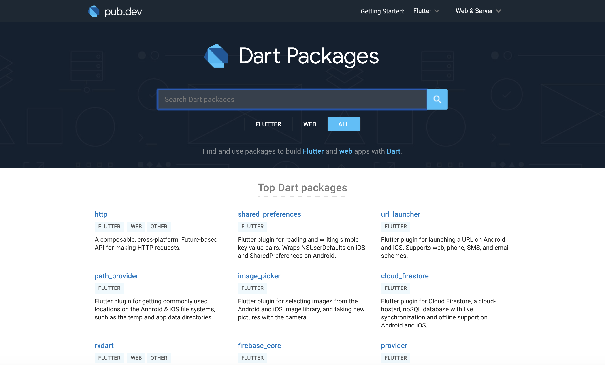
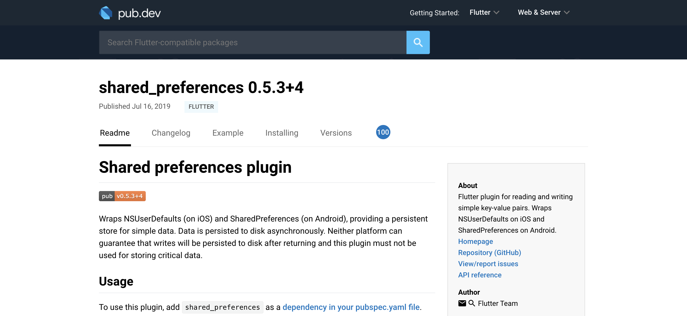

# 할 일 목록을 저장하기 


이번 장에서는 입력한 할 일 목록을 앱을 재시작해도 볼 수 있도록 저장하는 기능을 추가해보겠습니다. 이번에 새로 배울 기능은 다음과 같습니다. 

* Pub 을 사용해서 외부 라이브러리 추가하기 
* Flutter 의 async/await 을 통해 비동기 기능사용하기 
* 앱이 종료되도 유지되는 저장공간 사용하기 


# 외부 라이브러리 사용하기 

앱의 설정을 저장하기 위해서, 기기의 메모리 공간에 파일을 저장하는 방법이 있지만, flutter 에서는 shared_preference 라는 package 를 통해 쉽게 구현 할 수 있도록 하고 있습니다. 

먼저, 아래 사이트로 접속해주세요.

https://pub.dev/




이 사이트는 다른 개발자들이 미리 만들어놓은 기능들을 별도의 라이브러리로 만들어서 다른 개발자들과 공유할 수 있도록 모아놓은 사이트입니다. 검색창에서 shared_preference 를 검색해서 패키지 이름이 shared_preference 인 항목으로 들어가주세요. 만약 찾기 힘들다면, 아래 주소를 브라우저에 직접 입력하세요. (Author 가 Flutter Team 입니다.)


https://pub.dev/packages/shared_preferences




shared_preference 라이브러리는 iOS의 NSUserDefaults, Android의 SharedPreference 를 Flutter 에서 사용 할 수 있도록 만든 라이브러리입니다. 


라이브러리를 추가하기 위해서는 flutter 가 프로젝트 라이브러리 참조에 사용하는 pubspec.yaml 파일을 수정해야 합니다. 이 파일의 위치는 프로젝트 디렉토리/pubspec.yaml 입니다. 

직접 만들던 프로젝트에서 해당 파일을 열어보면 다음과 같은 내용이 나올것입니다. 주석은 생략했으며, flutter 버전이나 프로젝트 설정에 따라 다를 수도 있습니다. 


```
name: flutter_todo_layout
description: 할 일 목록 Flutter 앱입니다. 

version: 1.0.0+1

environment:
  sdk: ">=2.1.0 <3.0.0"

dependencies:
  flutter:
    sdk: flutter

  cupertino_icons: ^0.1.2

dev_dependencies:
  flutter_test:
    sdk: flutter
    
flutter:
  uses-material-design: true
```


하나하나 살펴보겠습니다. 아래 설명드린 것 외의 다른 설정은 https://dart.dev/tools/pub/pubspec 이 사이트를 참고하세요.

### name:

프로젝트의 이름이 되는 값을 설정합니다. 반드시 설정되어야 하는 값입니다. 직접 라이브러리를 만들게 된다면, 이 이름이 라이브러리 이름으로 등록됩니다. (그러니 라이브러리 프로젝트를 만들고 싶다면 위 )

### description:

추가적인 설명을 입력합니다. 

### version:

현재 만들어지는 앱의 버전을 설정합니다. 이 버전대로 앱이 만들어지고, 사용자가 해당 앱을 설치하면 어플리케이션 설정에서 볼 수 있는 앱의 버전이 바로 이 숫자를 통해 설정됩니다. 라이브러리를 만들었을 때도 해당 버전 값이 사용됩니다. 

### envirnoment:

호환되는 Dart SDK 의 버전을 설정합니다.  `sdk: ">=2.1.0 <3.0.0"`  의 의미는 , Dart SDK 2.1.0 버전부터 3.0.0 이하를 명시한것으로, 간단히 말하면 Dart 2 를 사용하도록 설정한 것입니다. 

### dependencies: 

이 프로젝트가 사용 할 라이브러리를 정의합니다. 지금은 flutter 와 cupertino_icons 만 정의되어있습니다. 작성법은, `cupertino_icons: ^0.1.2` 처럼 [라이브러리 이름]:[라이브러리 버전] 으로 필요한 라이브러리마다 추가하면됩니다. 

### dev_dependencies: 

개발 버전으로 앱을 만들 시 사용할 라이브러리를 정의합니다. 위 코드에서는 테스팅을 위한 flutter_test 가 정의되어있으며 실제 프로덕션 코드에서는 필요하지 않기 때문에 dev_dependencies 를 사용한 것입니다. 

### flutter:

pubspec.yaml 파일은 모든 Dart 프로젝트 빌드에 사용하는 설정 파일이지만, 위 파일의 `flutter:` 부분은 Flutter 에서만 사용하는 설정을 추가하게 됩니다. `use_material_design:` 의 경우는 이 프로젝트에서 구글 material 디자인의 아이콘들을 사용하게 해주는 설정입니다. 


우리가 변경해야 하는 부분은 dependencies 입니다. 아까 열어놓은 shared_preference 페이지를 참고하여, 코드를 변경해보겠습니다. 

```
dependencies:
  flutter:
    sdk: flutter
  shared_preferences: ^0.5.3+4 // 라이브러리이름:버전명 으로 작성합니다. 버전 숫자는 라이브러리 페이지에 명시된 대로 변경하세요.
```

<!-- 확실한가-->

버전 이름을 보면 `^` 기호가 앞에 사용되었는데요, 이는 `'>=0.5.3 <0.6.0'` 까지의 범위에서 서로 호환이된다는 뜻입니다. 예를 들어, shared_preferences 외의 라이브러리 내부에서 shared_preferences 라이브러리를 사용할 시 해당 범위내에 버전이 있기만 한다면 상관 없다는 뜻으로 사용합니다. 

추가했다면, 파일 상단 툴바 아래에 나오는 "Flutter commands" 메뉴에서 `Packages get` 을 선택해서 해당 라이브러리를 다운로드해야합니다. 


정상적으로 추가되었다면 ide 하단 messages 에 이렇게 표시 될 것입니다. 

```
Running "flutter pub get" in flutter_todo_layout...                 2.8s
Process finished with exit code 0
```


## main.dart 에서 shared_preferences 사용하기 

이제 shared_preference 라이브러리가 추가되었고 main.dart에서 import 하면 사용이 가능합니다. 

```
import 'package:shared_preferences/shared_preferences.dart';
```


먼저, TodoHomeState 의 필드로 SharedPreference 를 추가하겠습니다. 

```
class TodoHomeState extends State<TodoHome>{
	... 
	SharedPreferences preferences; 
	...
}
```

다음으로는 추가한 preferences 를 초기화해야하는데요, TodoHomeState 클래스에 그 역할을 하는 새로운 메소드를 만들겠습니다. 다음 코드를 TodoHomeState 클래스에 추가해주세요 .

```
// async, await 등의 새로운 키워드가 있습니다. 이어서 설명하겠습니다. 
Future<void> initPreference() async { 
    preferences = await SharedPreferences.getInstance();
}
```


### 비동기 작업을 위한 async, await 

뜬금없이 preference 기능을 사용하려고 하는데 갑자기 처음 보는 키워드가 등장했습니다. 이 키워드들은 dart에서 지원하는 비동기 작업 기능을 사용하기 위한 키워드들입니다. perference 를 사용하는 기능은 실제로는 파일을 읽고 쓰는 동작이기 때문에, 작업 시간이 오래 걸립니다. 만약 이런 기능을 동기 작업으로 한다면, 사용자가 특정 동작을 하고 그 작업이 끝날 때 까지 화면이 멈춰있게 됩니다. 그래서 이런 기능은 완료를 기다리지 않고, 일단 요청한 다음에 작업이 완료되면 나중에 완료시 필요한 작업을 실행합니다. 

[비동기 설명을 얼마나 해야 하나?]

async, await 은 비동기 작업코드를 동기적인 작업처럼 쉽게 작성하기 위한 dart 의 기능입니다. preference 기능은 실제로는 파일을 읽고 쓰는 I/O 작업이기 때문에 시간이 오래 걸립니다. 따라서 해당 작업이 완료되기를 코드에서 기다리고 있는것은 낭비이기 때문에, 작업을 등록하면 완료시에 결과를 처리 할 수 있게 만들어야 합니다. 

SharedPreferences.getInstance 의 반환값은 Future<SharedPreferences> 입니다. Future는 비동기 작업의 결과 타입을 제네릭으로 받아서 완료 시점을 기다릴 수 있게 해주는 기능을 제공합니다. 또한 async 블록에서 사용할 수 있는 await 키워드도 사용 할 수 있게 해줍니다. 

코드와 함께 보겠습니다. 

```
Future<void> initPreference() async { 
```

initPreferences 메소드는 Future<void>를 반환하며 때문에 async 키워드가 함수 구현부 `{` 바로 앞에 추가되었습니다. 

```
preferences = await SharedPreferences.getInstance();
```

앞서 TodoHomeState 에 필드로 추가한 preferences 를 초기화하는 부분입니다. 주목해야 할 부분은 await 키워드입니다. `await` 키워드를 `Future` 인스턴스 앞에 사용하게 되면 해당 비동기 작업의 결과를 사용 할 수 있습니다. (해당 비동기 작업이 끝날 때 까지 기다린다고 생각해도 됩니다. ) 

결과적으로 initPreference()는 preference를 비동기적으로 초기화하는 Future 을 반환하는 메소드가 됩니다. 사용하는 쪽에서는 다음과 같이 사용합니다. initState() 는 State클래스 초기화 시 호출되는 콜백입니다. 

```
  @override
  void initState() {
    super.initState();
    initPreference().then((result) {
      setState(() {
        // 설정에서 목록을 가져온 후 todos에 전부 추가되어, 기존에 기록되었던 목록이 앱 시작시 표시됩니다. 
        todos.addAll(preferences.getStringList(_KEY_TODOS) ?? Iterable.empty());
      });
    });
  }
```


이제 앱의 다른 부분에서도 설정을 변경 할 수 있게 해주면 됩니다. 즉, 앞서 작성하였던 추가/제거 시의 동작 부분에 preference를 사용하는 코드를 추가하게 됩니다. 

### 항목추가 

```
// TodoHomeState::build
floatingActionButton: FloatingActionButton(
  child: Icon(Icons.add),
  onPressed: () async { // 익명 함수를 async 로 변경합니다. 
    if (todoInputController.text.isNotEmpty) {
      setState(() {
        todos.add(todoInputController.text);
        todoInputController.clear();
      }
      // 기존 로직 이후에, 변경된 목록을 설정에 저장합니다. 
      await preferences.setStringList(_KEY_TODOS, todos);
    }
  },
),
```

### 항목 삭제 

```
// TodoHomeState::build 에서 TodoColumn을 생성하는 부분을 수정합니다. 
return TodoColumn(
  title: todos[index],
  onDismissed: (direction) async { // 익명 함수를 async로 변경합니다. 
    setState(() {
      todos.removeAt(index);
    });
    // todos 를 변경한 후, 변경된 todos 를 preference에 저장합니다. 
    await preferences.setStringList(_KEY_TODOS, todos);
  },
);
```


setStringList 또한 Future 을 반환하는 메소드이므로, 호출 시 맨 앞에 await 를 붙여주어야 합니다. 

이제 앱을 껏다 켜도, 이전에 저장하였던 항목들이 남아 있을것입니다. 다만, 지금까지 설정에 저장한 것은 오직 항목의 제목뿐이기 때문에, 항목을 완료했는지 의 상태가 앱 종료시 사라지게 됩니다. 이것 역시 설정에 완료된 항목을 따로 저장하고, 위젯을 빌드 할 때 완료된 목록에 포함되어 있다면 체크를 선택하고, 아니라면 체크를 없애는 등의 방법으로 저장 할 수 있습니다. 이 부분은 직접 해보기를 권장드립니다. 정답 예제는 아래 사이트에서 확인해보기 바랍니다. 

그런데 만약, 하나의 항목에 완료를 나타내는 정보 외에 완료 날짜라던가, 위치라던가, 추가 메모 등의 다양한 정보가 필요하다면 어떻게 될까요? 이러한 정보들을 preference 를 통해서 저장하기에는 너무 복잡하고 어려워 질 것입니다. 때문에, 다음 단계로는 이러한 항목 저장을 데이터베이스를 통해서 만들어보겠습니다. 