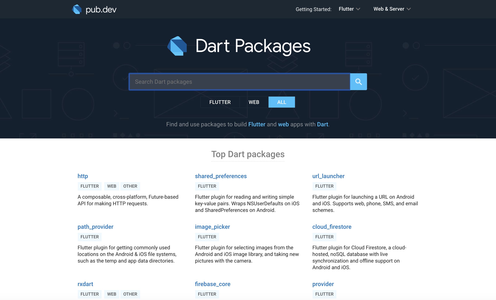
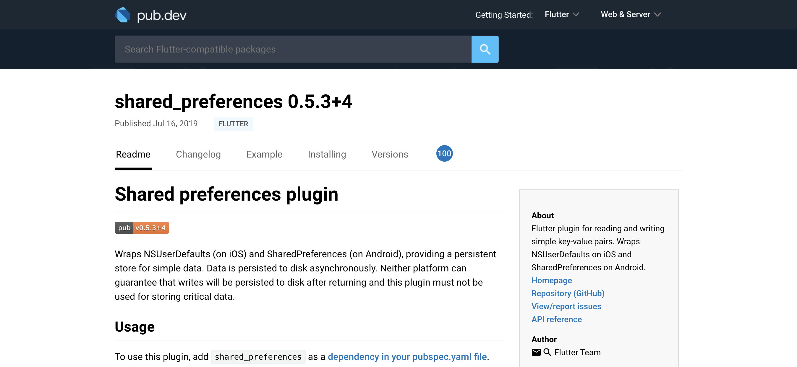
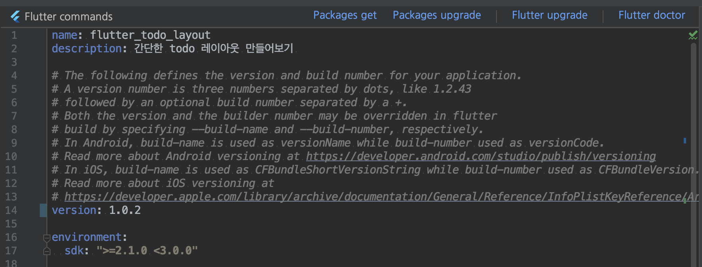

# 할 일 목록을 저장하기 


이번 장에서는 입력한 할 일 목록을 앱을 재시작해도 볼 수 있도록 저장하는 기능을 추가해보겠습니다. 이번에 새로 배울 기능은 다음과 같습니다. 

* Pub 을 사용해서 외부 라이브러리 추가하기 
* Flutter 의 async/await 을 통해 비동기 기능사용하기 
* 앱이 종료되도 유지되는 저장공간 사용하기 


# 외부 라이브러리 사용하기 

앱의 설정을 저장하기 위해서, 기기의 메모리 공간에 파일을 저장하는 방법이 있지만, flutter 에서는 shared_preference 라는 package 를 통해 쉽게 구현 할 수 있도록 하고 있습니다. 

먼저, 아래 사이트로 접속해주세요.

https://pub.dev/




이 사이트는 다른 개발자들이 미리 만들어놓은 기능들을 별도의 라이브러리로 만들어서 다른 개발자들과 공유할 수 있도록 모아놓은 사이트입니다. 검색창에서 shared_preference 를 검색해서 패키지 이름이 shared_preference 인 항목으로 들어가주세요. 만약 찾기 힘들다면, 아래 주소를 브라우저에 직접 입력하세요. (Author 가 Flutter Team 입니다.)


https://pub.dev/packages/shared_preferences




shared_preference 라이브러리는 iOS의 NSUserDefaults, Android의 SharedPreference 를 Flutter 에서 사용 할 수 있도록 만든 라이브러리입니다. 


라이브러리를 추가하기 위해서는 flutter 가 프로젝트 라이브러리 참조에 사용하는 pubspec.yaml 파일을 수정해야 합니다. 이 파일의 위치는 프로젝트 디렉토리/pubspec.yaml 입니다. 

직접 만들던 프로젝트에서 해당 파일을 열어보면 다음과 같은 내용이 나올것입니다. 주석은 생략했으며, flutter 버전이나 프로젝트 설정에 따라 다를 수도 있습니다. 


```
name: flutter_todo_layout
description: 할 일 목록 Flutter 앱입니다. 

version: 1.0.0+1

environment:
  sdk: ">=2.1.0 <3.0.0"

dependencies:
  flutter:
    sdk: flutter

  cupertino_icons: ^0.1.2

dev_dependencies:
  flutter_test:
    sdk: flutter
    
flutter:
  uses-material-design: true
```


하나하나 살펴보겠습니다. 아래 설명드린 것 외의 다른 설정은 https://dart.dev/tools/pub/pubspec 이 사이트를 참고하세요.

### name:

프로젝트의 이름이 되는 값을 설정합니다. 반드시 설정되어야 하는 값입니다. 직접 라이브러리를 만들게 된다면, 이 이름이 라이브러리 이름으로 등록됩니다. (그러니 라이브러리 프로젝트를 만들고 싶다면 위 )

### description:

추가적인 설명을 입력합니다. 

### version:

현재 만들어지는 앱의 버전을 설정합니다. 이 버전대로 앱이 만들어지고, 사용자가 해당 앱을 설치하면 어플리케이션 설정에서 볼 수 있는 앱의 버전이 바로 이 숫자를 통해 설정됩니다. 라이브러리를 만들었을 때도 해당 버전 값이 사용됩니다. 

### envirnoment:

호환되는 Dart SDK 의 버전을 설정합니다.  `sdk: ">=2.1.0 <3.0.0"`  의 의미는 , Dart SDK 2.1.0 버전부터 3.0.0 이하를 명시한것으로, 간단히 말하면 Dart 2 를 사용하도록 설정한 것입니다. 

### dependencies: 

이 프로젝트가 사용 할 라이브러리를 정의합니다. 지금은 flutter 와 cupertino_icons 만 정의되어있습니다. 작성법은, `cupertino_icons: ^0.1.2` 처럼 [라이브러리 이름]:[라이브러리 버전] 으로 필요한 라이브러리마다 추가하면됩니다. 

### dev_dependencies: 

개발 버전으로 앱을 만들 시 사용할 라이브러리를 정의합니다. 위 코드에서는 테스팅을 위한 flutter_test 가 정의되어있으며 실제 프로덕션 코드에서는 필요하지 않기 때문에 dev_dependencies 를 사용한 것입니다. 

### flutter:

pubspec.yaml 파일은 모든 Dart 프로젝트 빌드에 사용하는 설정 파일이지만, 위 파일의 `flutter:` 부분은 Flutter 에서만 사용하는 설정을 추가하게 됩니다. `use_material_design:` 의 경우는 이 프로젝트에서 구글 material 디자인의 아이콘들을 사용하게 해주는 설정입니다. 


우리가 변경해야 하는 부분은 dependencies 입니다. 아까 열어놓은 shared_preference 페이지를 참고하여, 코드를 변경해보겠습니다. 

```
dependencies:
  flutter:
    sdk: flutter
  shared_preferences: ^0.5.3+4 // 라이브러리이름:버전명 으로 작성합니다. 버전 숫자는 라이브러리 페이지에 명시된 대로 변경하세요.
```

<!-- 확실한가-->

버전 이름을 보면 `^` 기호가 앞에 사용되었는데요, 이는 `'>=0.5.3 <0.6.0'` 까지의 범위에서 서로 호환이된다는 뜻입니다. 예를 들어, shared_preferences 외의 라이브러리 내부에서 shared_preferences 라이브러리를 사용할 시 해당 범위내에 버전이 있기만 한다면 상관 없다는 뜻으로 사용합니다. 

추가했다면, 파일 상단 툴바 아래에 나오는 "Flutter commands" 메뉴에서 `Packages get` 을 선택해서 해당 라이브러리를 다운로드해야합니다. 



정상적으로 추가되었다면 ide 하단 messages 에 이렇게 표시 될 것입니다. 

```
Running "flutter pub get" in flutter_todo_layout...                 2.8s
Process finished with exit code 0
```


## main.dart 에서 shared_preferences 사용하기 

이제 shared_preference 라이브러리가 추가되었고 main.dart에서 import 하면 사용이 가능합니다. 

```
import 'package:shared_preferences/shared_preferences.dart';
```


먼저, TodoHomeState 의 필드로 SharedPreference 를 추가하겠습니다. 

```
class TodoHomeState extends State<TodoHome>{
	... 
	SharedPreferences preferences; 
	...
}
```

다음으로는 추가한 preferences 를 초기화해야하는데요, TodoHomeState 클래스에 그 역할을 하는 새로운 메소드를 만들겠습니다. 다음 코드를 TodoHomeState 클래스에 추가해주세요 .

```
// async, await 등의 새로운 키워드가 있습니다. 이어서 설명하겠습니다. 
Future<void> initPreference() async { 
    preferences = await SharedPreferences.getInstance();
}
```


### 비동기 작업을 위한 async, await 

뜬금없이 preference 기능을 사용하려고 하는데 갑자기 처음 보는 키워드가 등장했습니다. 이 키워드들은 dart에서 지원하는 비동기 작업 기능을 사용하기 위한 키워드들입니다. perference 를 사용하는 기능은 실제로는 파일을 읽고 쓰는 동작이기 때문에, 작업 시간이 오래 걸립니다. 만약 이런 기능을 동기 작업으로 한다면, 사용자가 특정 동작을 하고 그 작업이 끝날 때 까지 화면이 멈춰있게 됩니다. 그래서 이런 기능은 완료를 기다리지 않고, 일단 요청한 다음에 작업이 완료되면 나중에 완료시 필요한 작업을 실행합니다. 

[비동기 설명을 얼마나 해야 하나?]

async, await 은 비동기 작업코드를 동기적인 작업처럼 쉽게 작성하기 위한 dart 의 기능입니다. preference 기능은 실제로는 파일을 읽고 쓰는 I/O 작업이기 때문에 시간이 오래 걸립니다. 따라서 해당 작업이 완료되기를 코드에서 기다리고 있는것은 낭비이기 때문에, 작업을 등록하면 완료시에 결과를 처리 할 수 있게 만들어야 합니다. 

SharedPreferences.getInstance 의 반환값은 Future<SharedPreferences> 입니다. Future는 비동기 작업의 결과 타입을 제네릭으로 받아서 완료 시점을 기다릴 수 있게 해주는 기능을 제공합니다. 또한 async 블록에서 사용할 수 있는 await 키워드도 사용 할 수 있게 해줍니다. 

코드와 함께 보겠습니다. 

```
Future<void> initPreference() async { 
```

initPreferences 메소드는 Future<void>를 반환하며 때문에 async 키워드가 함수 구현부 `{` 바로 앞에 추가되었습니다. 

```
preferences = await SharedPreferences.getInstance();
```

앞서 TodoHomeState 에 필드로 추가한 preferences 를 초기화하는 부분입니다. 주목해야 할 부분은 await 키워드입니다. `await` 키워드를 `Future` 인스턴스 앞에 사용하게 되면 해당 비동기 작업의 결과를 사용 할 수 있습니다. (해당 비동기 작업이 끝날 때 까지 기다린다고 생각해도 됩니다. ) 

결과적으로 initPreference()는 preference를 비동기적으로 초기화하는 Future 을 반환하는 메소드가 됩니다. 사용하는 쪽에서는 다음과 같이 사용합니다. 

```
  @override
  void initState() {
    super.initState();
    initPreference().then((result) {
      setState(() {
        todos.addAll(preferences.getStringList(_KEY_TODOS) ?? Iterable.empty());
      });
    });
  }
```