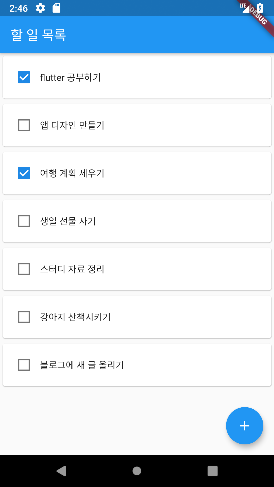
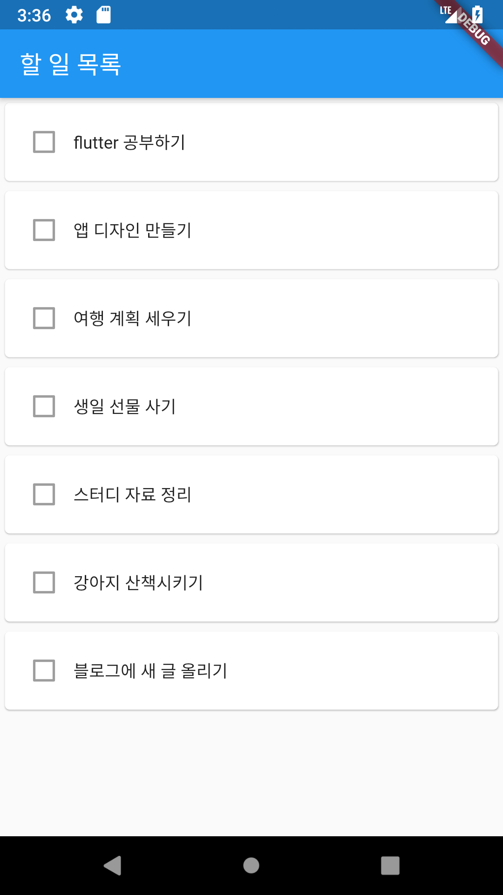
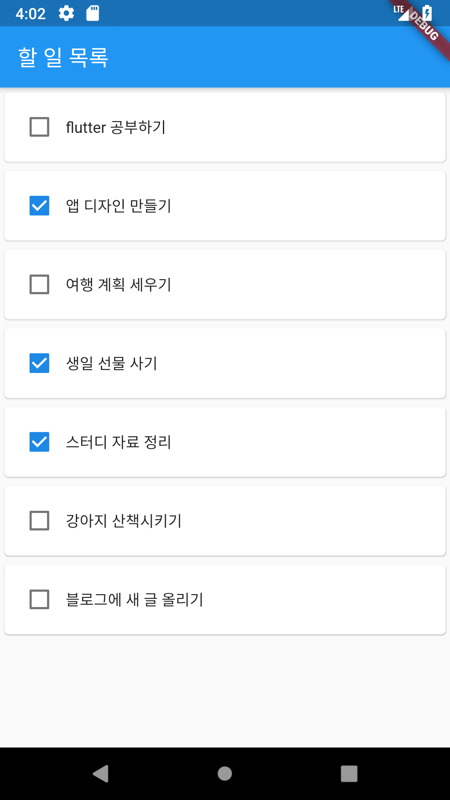
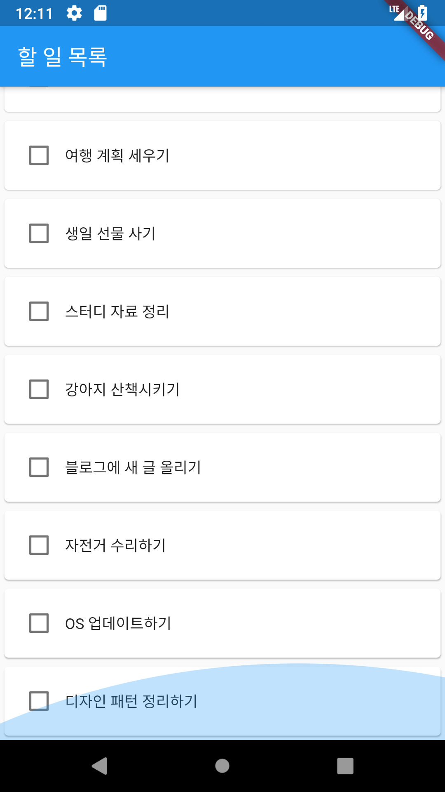
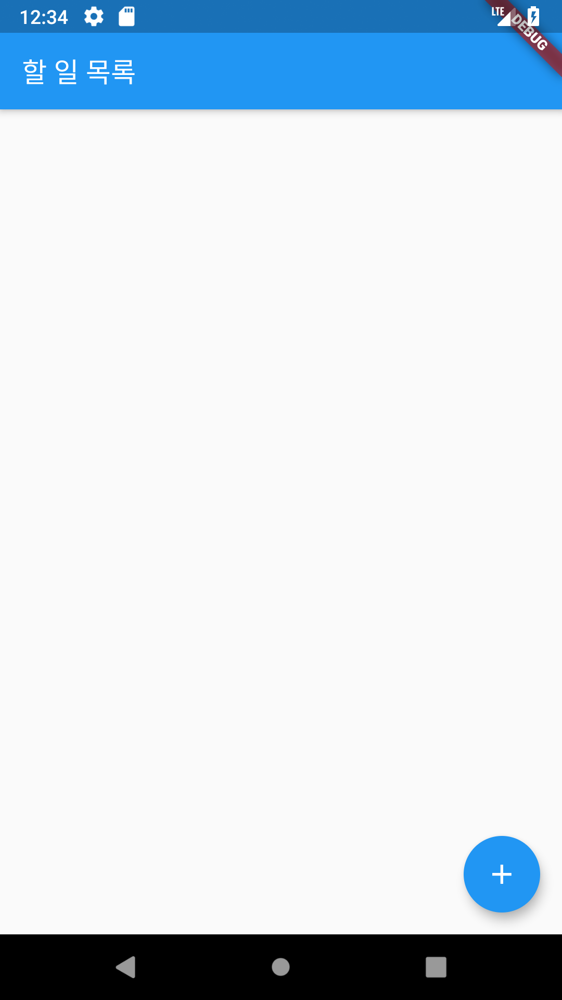

### 할일 목록 앱으로 알아보는 Flutter 의 State 


이전 장에서 Flutter 의 기본적인 위젯들을 사용하여 할 일 목록 화면을 만들어봤습니다.  하지만 이 앱을 실제로 사용 할 수 있을까요? 앞서 말했던 현재 앱 상태의 단점을 살펴보겠습니다. 


때문에 이번 장에서는 조금 더 나아가서, 한 일을 표시 할 수 있도록 하고, 직접 항목을 추가 할 수 있도록 해보겠습니다. 이번에 만들어볼 앱의 화면은 다음과 같습니다. 




각 항목당 완료하였는지 체크할 수 있게 되었고, 새로운 항목을 앱에서 추가할 수 있게되었습니다. 

이제 시작해보겠습니다. 먼저 이전 프로젝트를 열고 , TodoColumn 을 봐주세요.


```
class TodoColumn extends StatelessWidget {
  final String title;

  TodoColumn({this.title});

  @override
  Widget build(BuildContext context) {
    return SizedBox(
      width: double.infinity,
      child: Card(
        child: Padding(
          padding: const EdgeInsets.all(16.0),
          child: Text(title),
        ),
      ),
    );
  }
```


TodoColumn 은 Stateless 위젯입니다. 처음에 설정하는 title 을 사용해서 할 일 목록 한가지를 표시하는 위젯입니다. 하지만 이제는 체크표시를 추가하고, 그 체크 표시는 이 할 일 항목이 완료된것인지, 아닌지를 나타내는 "상태"를 가지고 표시되어야 합니다. 즉 계속 바뀌면서 업데이트 되어야 하는 위젯으로 사용되어야 하고, 그에 적합하게 Stateful 위젯으로 변경해야합니다. 

TodoColumn 위젯을 Stateful 위젯으로 바꿔보겠습니다. 먼저, TodoColum 위젯이 StatefulWidget 클래스를 상속하도록 변경합니다. 

이부분을 

```
class TodoColumn extends StatelessWidget {
```

이렇게 변경해주세요.

```
class TodoColumn extends StatefulWidget {
```

변경하면 TodoColumn 부분에 빨간 줄이 표시되며 아래와 같은 메시지가 나올것입니다. 

> Missing concrete implementation of StatefulWdiget.createState.
>
> Try implementing the missing method, or make the class abstract.


Stateful 위젯은 createState() 라는 메소드를 오버라이딩 해주어야 합니다.  이를 위해 TodoColumn 클래스 아래에 TodoColumnState 라는 클래스를 새로 만들어주겠습니다. 


```
class TodoColumnState extends State<TodoColumn> {
  @override
  Widget build(BuildContext context) {
    //TODO TodoCoulmn 의 
  }
}
```

State 클래스를 상속하고, State 가 받는 제네릭으로는 이 State 를 사용할 위젯 클래스로 전달해야 합니다. 이번에는 TodoColumn 입니다. 그리고, build() 메소드를 오버라이딩해주세요.  이 build() 메소드는 이전 StatelessWidget 의 build() 메소드와 같은 역할을 하기 때문에 그대로 옮겨주도록 하겠습니다. 


```
class TodoColumnState extends State<TodoColumn> {
  @override
  Widget build(BuildContext context) {
    return SizedBox(
      width: double.infinity,
      child: Card(
        child: Padding(
          padding: const EdgeInsets.all(16.0),
          child: Text(widget.title), // widget.title로 변경
        ),
      ),
    );
  }
}
```

코드를 그대로 옮겨주면, 이전에 사용하던 title 변수가 TodoColumnState에는 없기 때문에 title 에 빨간 줄이 표시될 텐데요, 사용하는 위젯클래스에서 가져오도록 변경해야 합니다. `Text(title)` 을 `Text(widget.title)` 로 변경해주세요. 

이후 앞서서 만들었던 TodoColumnState 클래스에 아래처럼 createState() 메소드를 구현해줍니다. 

```
class TodoColumn extends StatefulWidget {
  final String title;

  TodoColumn({this.title});

  @override
  State createState() => TodoColumnState();
}
```


정상적으로 실행되는지 확인해주세요. 만약 에러 없이 실행된다면, TodoCoulmn 위젯이 성공적으로 Stateful위젯으로 변경된것입니다!


## 완료상태 추가하기

TodoColumn이 Stateful 위젯이 되었으니, 실제로 "상태" 를 추가해보겠습니다. 우리가 추가할 것은 이 항목을 완료했는지 아닌지에 대한 정보입니다. 이를 표시하기위해 먼저 CheckBox 위젯을 추가해보겠습니다. TodoColumnState의 build() 메소드를 다음과 같이 바꿔주세요. 

```
//class TodoColumState
@override
  Widget build(BuildContext context) {
    return SizedBox(
      width: double.infinity,
      child: Card(
        child: Padding(
          padding: const EdgeInsets.all(8.0),
          child: Row(
            children: <Widget>[
              Checkbox(
                value: false,
              ),
              Text(widget.title),
            ],
          ),
        ),
      ),
    );
  }
```


먼저, 기존 padding 위젯의 child 를 Row 로 바꿔줍니다. 해당 UI 에는 체크박스와 타이틀이 가로로 배열되어 표시될 것이기 때문입니다. 그 다음, Row의 첫번째 children 으로 Checkbox를 추가해줍니다. Checkbox는 생성자의 value 파라미터로 기본값을 반드시 설정하여야 합니다. 이번에는 false 로 설정해보겠습니다. 그다음 실행해보면, 원래 할 일 목록 항목 맨앞에 다음처럼 체크박스가 추가 될 것입니다. 다만, 체크박스를 선택해보면 아무런 변화가 없을 텐데요, 바로 다음에 이어서 설명해드리겠습니다. 





> 주의 : 화면의 세로 길이가 짧거나 목록을 여러개 추가한 경우, TodoColumn 위젯이 화면을 넘어갈 수도 있습니다. 그 경우에 핸드폰 화면에서 아래 스크린 샷과 같은 오류가 표시될 수 있는데요,
>
> 
> 당황하지 말고, Padding 위젯의 padding 값을 줄이거나 항목을 줄이면 해당 오류가 없어지게 됩니다. 현재 스크롤이 되지 않기 때문에 아래 항목이 가려지면 볼 수 없어서 나타나는 오류이며, 앞으로 진행하면서 스크롤이 가능하도록 변경 할 것이기 때문에 지금은 걱정하지 않으셔도 됩니다. 


### setState를 추가하여야 한다. 

앞서 말씀드린대로, 체크박스를 터치해도 아무런 변화가 없는데요, 그 이유는 Flutter 위젯이 결국은 상태를 받아 그리는 일 만 할 수 있기 때문입니다. (todo 이해할 수 있는 비교 추가) 

즉 우리는 TodoColumnState 에 체크 상태를 나타내는 "값"을 추가하고 그 값을 Checkbox 가 사용하도록 하면 됩니다. 

TodoColumState에 isDone 이라는 bool 값을 추가하고, Checkbox를 선택할 때 마다 해당 값을 바꿀 수 있도록 익명함수를 선언하며, Checkbox 위젯이 표시하는 값을 새로 추가한 변수인 isDone 으로 변경해주세요.

```dart
class TodoColumnState extends State<TodoColumn> {

  bool isDone = false; // 완료 상태를 나타내는 변수를 추가.
  
  @override
  Widget build(BuildContext context) {
    return SizedBox(
      width: double.infinity,
      child: Card(
        child: Padding(
          padding: const EdgeInsets.all(16.0),
          child: Row(
            children: <Widget>[
              Checkbox(
                value: isDone, // value 파라미터로 isDone을 사용하고..
                onChanged: (bool value) { 
                  // onChanged 에서 isDone을 변경합니다. 
                  // 이 익명함수로 전달되는 value는 선택 시 true, 해제시 false 가 전달됩니다. 
                  isDone = value;
                },
              ),
              Text(widget.title),
            ],
          ),
        ),
      ),
    );
  }
```


이제 실행하고 체크박스를 선택해보겠습니다. 터치하는 효과는 추가되었는데 체크 표시가 변경되지는 않네요. 한가지가 빠졌습니다. 우리는 onChanged 에서 isDone을 선택시마다 변경하도록 한것은 맞습니다. 그러나 Flutter 에서는 추가적으로 "지금 이 값을 바꾸면 위젯을 새로그려야 한다" 라는 동작을 해야 합니다. 이는 setState() 메소드를 사용하면 됩니다. 

setState() 는 프레임워크에 UI 를 새로 그려야 한다는 명령을 합니다. 매개변수로는 익명 함수가 들어가게 되는데, 이 함수를 실행할 때 변경되는 상태 변수를 사용하는 UI 가 새로 그려지게 됩니다. 

위의 onChanged부분을 아래와 같이 바꿔보겠습니다. 

```
onChanged: (bool value) {
  //setState() 메소드의 인자로 isDone 의 값을 바꾸는 익명 함수를 전달합니다. 
  setState(() {
    isDone = value;
  });
},
```

이제 체크 변경시 정상적으로 UI가 정상적으로 변경될것입니다. 




### 새로운 항목 추가하기

지금의 앱은 코드에서 작성한 항목만 화면에 표시합니다. 그러나, 실제로 할 일 목록 앱을 만들어서 사용하려면 앱 상에서 추가, 삭제를 할 수 있어야 합니다. 이번 차례에서는 앱에서의 입력을 통해서 해당 리스트를 변경 할 수 있도록 해보겠습니다. 

순서대로 정리해보면, 

* 메인 화면을 Stateful하도록 변경하기 
* 추가, 삭제 할 수 있는 UI 정의하기 
* 해당 UI 를 통한 상태 변경으로 할 일 목록 편집하기 


### 메인화면을 Stateful하도록 변경하기 

이전에, 할 일 목록 하나의 항목에 체크표시를 하기 위해 isDone 이라는 상태를 사용하는 TodoColumn 이라는 Stateful 위젯을 만들었었습니다. 즉, 이제 할 일 목록을 편집하기 위해서는, 이 메인 화면 위젯(TodoHome) 또한 할일 목록을 상태로 가지는 Stateful위젯으로 변경해주어야 합니다. 앞에 있던 TodoColumn을 변경한 것 처럼, TodoHome 위젯을 Stateful 위젯을 상속하도록 변경하고, TodoHomeState 를 만들어주겠습니다. 

```
// TodoHome 을 StatefulWidget을 상속하도록 변경합니다. 
class TodoHome extends StatefulWidget {

  // createState() 에서 TodoHomeState()를 반환하도록 합니다. 
  @override
  State<StatefulWidget> createState() => TodoHomeState();
}

// TodoHome 의 기존 build() 를 그대로 구현하는 TodoHomeState를 만들어줍니다. 
class TodoHomeState extends State<TodoHome> {

  @override
  Widget build(BuildContext context) {
    return Scaffold(
        appBar: AppBar(
          title: Text('할 일 목록'),
        ),
        body: Column(
          children: <Widget>[
            TodoColumn(title: "flutter 공부하기"),
            TodoColumn(title: "앱 디자인 만들기"),
            TodoColumn(title: "여행 계획 세우기"),
            TodoColumn(title: "생일 선물 사기"),
            TodoColumn(title: "스터디 자료 정리"),
            TodoColumn(title: "강아지 산책시키기"),
            TodoColumn(title: "블로그에 새 글 올리기"),
          ],
        ));
  }
}
```


다음으로는 목록을 State 의 필드로 추가해보겠습니다. 지금은 할 일 목록의 제목 목록으로 사용하기 위해 List<String> 을 사용하겠습니다. 먼저, 원래 있던 항목들을 TodoHomeState 클래스의 필드로 선언해줍니다. 

```
// TodoHomeState
List<String> todos = <String>[
    "flutter 공부하기",
    "앱 디자인 만들기",
    "여행 계획 세우기",
    "생일 선물 사기",
    "스터디 자료 정리",
    "강아지 산책시키기",
    "블로그에 새 글 올리기"
  ];
```


이후 Scaffold 의 body 로 사용하던 Column 의 children 값을 해당 리스트를 통해서 만들어주겠습니다. 이전에 사용하던 Column을 사용하지 않고, 여러개의 항목이 들어가도 스크롤을 통해 볼 수 있는 ListView 위젯을 사용해보겠습니다. ListView.Builder 를 사용할 것이며, 사용되는 파라미터는 itemCount, itemBuilder 입니다. itemCount는 리스트의 총 크기값이 되는 상태를 주어야 하고, itemBuilder 로는 BuildContext, int 값을 받아 하나의 위젯을 리턴하는 익명 함수를 전달해야 합니다. 


```
class TodoHomeState extends State<TodoHome> {
  List<String> todos = <String>[
    "flutter 공부하기",
    "앱 디자인 만들기",
    "여행 계획 세우기",
    "생일 선물 사기",
    "스터디 자료 정리",
    "강아지 산책시키기",
    "블로그에 새 글 올리기"
  ];

  @override
  Widget build(BuildContext context) {
    return Scaffold(
      appBar: AppBar(
        title: Text('할 일 목록'),
      ),
      // body 의 값으로 ListView.Bulider 를 사용한 ListView 위젯을 전달합니다. 
      body: ListView.builder(
          itemCount: todos.length, 
          itemBuilder: (BuildContext context, int index) {
            return TodoColumn(title: todos[index]);
          }),
    );
  }
}
```


이제는 이전과 달리 목록을 더 여러개로 늘려서 화면을 넘어가도 화면을 스크롤 해서 확인 할 수 있습니다. 



[스크롤 되는 화면 ]


## 아이템을 추가 / 삭제하기 

지금은 코드에 직접 넣어준 리스트로만 화면에 표시하고 있지만, UI 를 통해 추가/ 제거 할 수 있도록 해보겠습니다. 먼저, 코드에 직접 선언해 준 List를 빈 리스트로 변경하겠습니다. 


```
List<String> todos = List();
```

다시 실행해보면 빈 화면이 표시될 것입니다. 여전히 ListView는 표시되고 있으나, 항목이 사라졌기 때문에 그런것입니다. 이제, 항목을 추가할 수 있는 UI를 만들어보겠습니다. Scaffold 위젯에서 제공하는 floatingActionButton 속성을 사용해보겠습니다. 전달해주는 값으로는 FloatingActionButton 위젯에 child로 Icon 위젯을 추가하여 사용하겠습니다. onPressed 또한 빈 익명함수로 정의하고 실행해보겠습니다. 


```
// TodoHomeState > build 메소드 
  @override
  Widget build(BuildContext context) {
    return Scaffold(
      appBar: AppBar(
        title: Text('할 일 목록'),
      ),
      body: ListView.builder(
          itemCount: todos.length,
          itemBuilder: (BuildContext context, int index) {
            return TodoColumn(title: todos[index]);
          }),
      floatingActionButton: FloatingActionButton(
        child: Icon(
          Icons.add 
        ),
        onPressed: () {

        },
      ),
    );
  }
```



[하단 우측에 버튼이 추가됨]

이제, 할 일 이름을 추가 할 수 있는 UI 를 만들어보겠습니다. FloatingActionButton 위젯 옆에 Card 위젯과 TextField 위젯을 사용해서 만들어보겠습니다. 


[완성본]


홈화면의 전체는 지금 ListView 위젯으로 가득 차 있기 때문에 위에 떠 있는거 같은 위치에 위젯을 그리려면 Stack 위젯을 사용해야합니다. 

현재 메인 화면의 구조는 아래와 같습니다. 

[메인화면 구조 설명 그림]

Stack을 사용하면 여러개를 겹치는 UI 가 가능합니다. 아래 그림처럼 입력위젯을 위치시켜보겠습니다. 


먼저, TodoHomeState 의 build메소드에서 Scaffold 생성자의 body 위젯을 Stack으로 변경하고 원래 ListView는 Stack의 children 안으로 이동하겠습니다. 	

```
// TodoHomeState > build > Scaffold
body: Stack(
  children: <Widget>[
    ListView.builder( // ListView 를 Stack의 children 으로 변경 
        itemCount: todos.length,
        itemBuilder: (BuildContext context, int index) {
          return TodoColumn(title: todos[index]);
        }),
  ],
)
```


다음으로는 ListView 위에 그릴 새로운 위젯이 필요합니다. 새로운 위젯의 형태는 아래와 같습니다. 

[화면 전체를 덮고 아래쪽으로 children이 내려가 있는 도움그림]


Stateless 위젯인 TodoInput 위젯을 만들어보겠습니다. TodoHomeState 밑에 TodoInput 클래스를 새로 만들어주세요. 그 다음, build 메소드에서 Container 위젯을 반환하도록 하겠습니다. 

```
class TodoInput extends StatelessWidget {

  @override
  Widget build(BuildContext context) {
    return Container();
  }
}
```

Container 위젯은 해당 위젯의 child를 다양한 방법으로 배치 할 수 있게 해줍니다. Padding, Alignment 등의 값을 전달해주어서 child의 padding 조절, 상단에 있을지, 하단에 배치할 지 조정 할 수 있습니다. 이번에는 child 를 하단 시작에 배치하고 FloatingAction 버튼에 가려지지 않게 하기 위해서 alignment 와 여백을 추가해보겠습니다. child 로는 TextField 위젯을 child 로 가지는 Card 위젯을 추가하겠습니다. TextField 위젯은 사용자의 텍스트 입력을 받기 위한 위젯입니다. 자세한 사용법은 조금 더 진행 후에 설명하겠습니다. 


```
class TodoInput extends StatelessWidget {
  @override
  Widget build(BuildContext context) {
    return Container(
        alignment: AlignmentDirectional.bottomStart, // 하단 시작에 위치 할 수 있게 해줍니다.
        padding: const EdgeInsets.fromLTRB(16.0, 0.0, 80.0, 12.0),
        child: Card(
          child: TextField(),
        ));
  }
}
```


> alignment 값으로는 AlignmentDirectional에 있는 필드들을 사용하면 됩니다. 위 bottomStart 말고도 center, topEnd 등의 다양한 값이 있습니다. 변경해보면서 확인해보세요.
>
> padding 값으로는 EdgeInsets.fromLTRB 를 사용했는데요, left, top, right, bottom 순서로 여백 값을 정한 EdgeInsets 인스턴스를 반환하는 메소드입니다. 만약 네 방향 다 같은 값으로 여백을 주고 싶다면 EdgeInsets.all 을 사용하면 됩니다. 


저장 해보면 다음과 같은 화면이 될것입니다. 


약간 어색한 부분이 있지만 원하는 위치에 표시되었고 텍스트 입력도 해 볼 수 있게 되었습니다. (물론 단순히 입력만 가능합니다) 약간의 여백과 elevation설정을 변경해서 조금 더 자연스럽도록 바꿔보겠습니다. 보이는 모습을 바꾸는 것이므로 필수는 아니지만, 직접 속성 값들을 바꿔본다는 의미는 있습니다.  다음 코드를 참고해서 변경해보세요. 물론 원하는 값으로 직접 바꿔도 됩니다. 

[속성 문서 보는법... 추가?]

```
class TodoInput extends StatelessWidget {
  @override
  Widget build(BuildContext context) {
    return Container(
        alignment: AlignmentDirectional.bottomStart,
        padding: const EdgeInsets.fromLTRB(16.0, 0.0, 80.0, 12.0),
        child: Card(
          elevation: 6.0, // Card 가 더 떠있는것처럼 보이도록 값을 주었습니다. 
          shape: RoundedRectangleBorder( // 조금 더 부드러운 느낌을 주도록 꼭지점 둥근 정도를 변경합니다. 
              borderRadius: BorderRadius.all(
                Radius.circular(16.0),
              )),
          child: Padding(
            padding: const EdgeInsets.all(16.0),
            child: TextField(
                // decoration을 추가합니다. 
                // InputDecoration.collapsed 를 사용하면 hint 를 추가함과 동시에 
                // TextField의 밑줄이 사라지게 됩니다. 
                decoration: InputDecoration.collapsed(hintText: "할 일을 입력하세요.")),
          ),
        ));
  }
}
```


위 코드를 그대로 적용하면 다음과 같은 모습이 될것입니다. 


### TodoInput 레이아웃의 입력값을 목록에 추가하기 

화면에 입력을 받아 추가하기 위한 과정이 거의 완료되었습니다. 이제 해야 하는 일은 다음과 같습니다. 

* FloaingActionButton을 누르면, TodoInput의 입력값을, 할 일 목록인 todos 에 추가하기 

[먼저 상태를 바꾸고 ]

Flutter 은 Android, iOS 코드처럼 "OO 뷰에서 getOOO 해서 사용" 하는 방법이 불가능합니다. Flutter 에서 사용하는 방법은 해당 값의 상태를 바꿔주는 것입니다. 즉, 지금은 다음의 순서를 거쳐야 합니다. 

*  TextField 의 값이 바뀐다 
* 바뀐 값을 상태에 저장한다. 
* 추가 입력을 받으면 바뀌어 있는 상태를 사용해서 todo 항목에 추가한다. 


### TodoInput이 TodoHomeState를 변경 할 수 있도록 하기 

간단한 방법을 사용해보겠습니다. 실제로 값을 입력하는 위젯은 TextField 위젯입니다. 그러므로 TodoInput 위젯이 값 변경을 알려주는 기능을 가지려면 TextField 로 넘겨주는 onChanged 를 사용해야 합니다. TextField 의 onChanged 는 Function객체가 들어가며, 입력 값이 변경될 때 마다 넘겨준 Function을 실행시키게 됩니다. 

```
TextField(
  // onChanged 로 넘겨준 익명함수가 TextField 의 값이 변경될 때 마다 호출됩니다. 
  onChanged: (String value) { // value 는 변경된 입력값이 전달됩니다. 
  }
)
```


TodoInput 위젯을 사용하는 쪽에서 onChanged를 정의 할 수 있도록, TodoInput 위젯의 생성자로 Function을 받고 이를 TextField 위젯 생성자의 onChanged 값으로 전달해보겠습니다. 


```
class TodoInput extends StatelessWidget {

  // 필드로 onChanged Function을 추가 
  final Function onChanged;
  // 생성자에서 onChanged를 받을 수 있도록 추가
  TodoInputA({this.onChanged});

  @override
  Widget build(BuildContext context) {
    return Container(
        alignment: AlignmentDirectional.bottomStart,
        padding: const EdgeInsets.fromLTRB(16.0, 0.0, 80.0, 12.0),
        child: Card(
          elevation: 6.0,
          shape: RoundedRectangleBorder(
              borderRadius: BorderRadius.all(
            Radius.circular(16.0),
          )),
          child: Padding(
            padding: const EdgeInsets.all(16.0),
            child: TextField(
                onChanged: onChanged,
                decoration: InputDecoration.collapsed(hintText: "할 일을 입력하세요.")),
          ),
        ));
  }
```


### FloatingActionButton의 onPressed 변경하기 

이렇게 변경된 TodoInput 위젯을 활용하여, TodoHomeState 코드를 변경해보겠습니다. 먼저 TodoHomeState의 필드로 String inputValue 를 추가해줍니다. 현재 입력 값을 가지는 상태값이 될 것입니다. 다음으로는 TodoInput 위젯의 onChanged 에 넘겨주는 익명함수에서 이 inputValue를 변경하게 하겠습니다. 


```
class TodoHomeState extends State<TodoHome> {
  List<String> todos = List();
  // 1. 입력 값을 들고있는 필드 추가
  String inputValue;

  @override
  Widget build(BuildContext context) {
    return Scaffold(
      appBar: AppBar(
        title: Text('할 일 목록'),
      ),
      body: Stack(
        children: <Widget>[
          ListView.builder(
              itemCount: todos.length,
              itemBuilder: (BuildContext context, int index) {
                return TodoColumn(title: todos[index]);
              }),
          TodoInput(
            onChanged: (value) {
              // TodoInput 위젯 안의 TextField의 값이 변경시마다 inputValue를 변경 
              inputValue = value;
            },
          )
        ],
      ),
      ...
      ...
      ...
    );
  }
```


다음으로는, FloatingActionButton 위젯이 눌릴 때 마다 inputValue 의 값을 todos 에 추가하도록 합니다. 

```
// FloatingActionButton 의 onPressed 를 변경합니다. 
floatingActionButton: FloatingActionButton(
        child: Icon(Icons.add),
        onPressed: () {
          //setState 를 사용해야 todos의 변경이 ListView 를 변경하도록 할 수 있습니다. 
          setState(() {
            if (inputValue.isNotEmpty) { // 입력이 있을 때만 추가하도록 조건을 추가했습니다. 
              todos.add(inputValue);
            }
          });
        },
      ),
```


이제 실행해보겠습니다. TodoInput 위젯을 선택하여 아무 값이나 입력하고 + 를 누르면 화면에 새로운 항목이 추가되는 것을 볼 수 있게됩니다. 여러개를 추가하여도 스크롤을 통해 확인이 가능합니다.


### 추가 할 때 마다 입력값을 없어지도록 하기 

지금 여러 항목을 추가하다보면, 추가 버튼을 눌러도 TodoInput의 값이 이전 값을 그대로 유지하는 것을 볼 수 있는데요, 실제 앱이라면 추가 할 때 마다 입력한 값이 없어져야 할 것입니다. 하지만 값을 표시할 TextField에는 현재 표시되는 텍스트를 전달 할 수 있는 항목은 없고, TextEditingController 를 통해서 간접적으로 표시해야 합니다. 뭔가 값을 바로 설정하지 않고 다른 객체를 사용하는것이 불편해 보일 수 있지만, 사실 앞서 했던 TodoInput에 onChanged 를 추가하여 TodoHomeState 를 변경한 코드를 더 간단하게 바꿀 수 있습니다. 

[여기를 어떻게 설명해야 좋은가?]


### TextEditingController 사용하기 

TodoInput 위젯을 TextEditingController 를 사용하도록 변경해보겠습니다. 실제로 TextEditingController 를 사용하는 것은 child 중 하나인 TextField 이므로, TodoInput 위젯의 생성자에서 TextEditingController 를 받아 TextField 위젯에서 사용하도록 변경하겠습니다. 


```
class TodoInput extends StatelessWidget {
  // TextEditingController 를 필드로 추가합니다. 
  final TextEditingController controller;

  TodoInput({this.controller});

  @override
  Widget build(BuildContext context) {
    return Container(
        alignment: AlignmentDirectional.bottomStart,
        padding: const EdgeInsets.fromLTRB(16.0, 0.0, 80.0, 12.0),
        child: Card(
          elevation: 6.0,
          shape: RoundedRectangleBorder(
              borderRadius: BorderRadius.all(
            Radius.circular(16.0),
          )),
          child: Padding(
            padding: const EdgeInsets.all(16.0),
            child: TextField(
                // TextField 의 controller 값으로 새로 추가한 TextEditingController 를 추가합니다. 
                controller: controller,
                decoration: InputDecoration.collapsed(hintText: "할 일을 입력하세요.")),
          ),
        ));
  }
```


다음으로,  TodoInput을 사용시 새로운 TextEditingController 인스턴스를 생성해서 생성자에 넘겨주면, TodoHomeState 를 다음처럼 변경 할 수 있게 됩니다. 


```
class TodoHomeState extends State<TodoHome> {
  List<String> todos = List();
  // String inputValue 를 삭제하고 todoInputController 인스턴스를 추가합니다. 
  var todoInputController = TextEditingController();

  @override
  Widget build(BuildContext context) {
    return Scaffold(
      appBar: AppBar(
        title: Text('할 일 목록'),
      ),
      body: Stack(
        children: <Widget>[
          ListView.builder(
              itemCount: todos.length,
              itemBuilder: (BuildContext context, int index) {
                return TodoColumn(title: todos[index]);
              }),
          TodoInputA(
            controller: todoInputController, // 생성자를 변경합니다. 
          )
        ],
      ),
      floatingActionButton: FloatingActionButton(
        child: Icon(Icons.add),
        onPressed: () {
          setState(() {
            // 이전처럼 inputValue를 가져다가 표시하는 것이 아니라, 
            // todoInputController 를 통해 간접적으로 값을 가져옵니다. 
            // 추가적으로 clear()를 통해 항목 추가시마다 기존 입력이 없어지도록 할 수 있습니다. 
            if (todoInputController.text.isNotEmpty) { 
              todos.add(todoInputController.text);
              todoInputController.clear();
            }
          });
        },
      ),
    );
  }
  
  // 주의: TextEditingController를 dispose 해주어야 합니다. 
  @override
  void dispose() {
    todoInputController.dispose();
    super.dispose();
  }
}
```


변경된 코드를 살펴보겠습니다. 일단 먼저 기존에 있던 inputValue를 제거하였습니다. 이후 FloatingActionButton에서 사용하던 값은 todoInputController를 통해 간접적으로 가져 올 수 있습니다. 또한, clear() 메소드를 사용하여 항목 추가시마다 입력창이 비워지게 됩니다. 

> 주의 : 
>
> TextEditingController 는 State의 dispose 마다 똑같이 dispose() 를 해주어야 합니다. 
>
> [왜 그래야하는가 더 자세히]


## 항목 삭제하기 


<!-- 주석주석--> 

[flutter key 설명하기 ]

[Dismissible 위젯 설명하기]